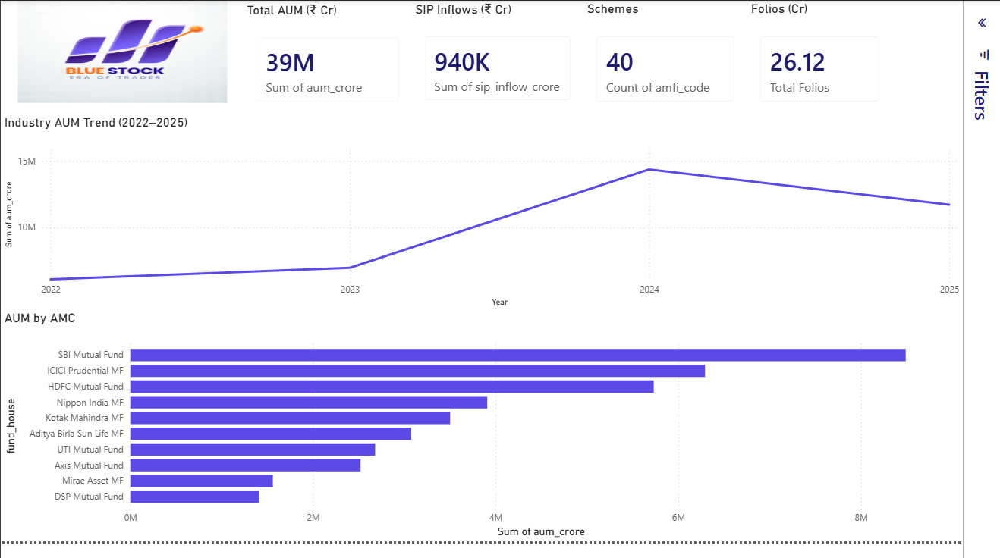
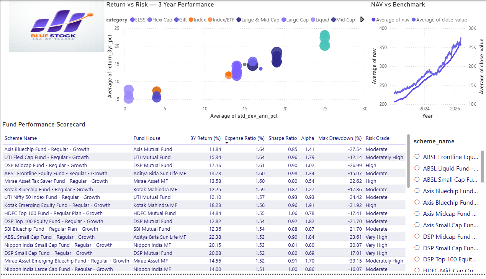
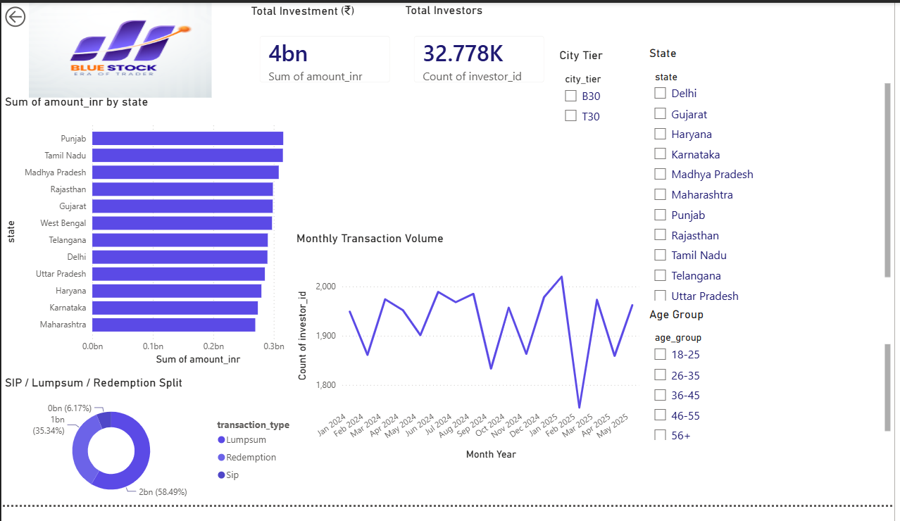
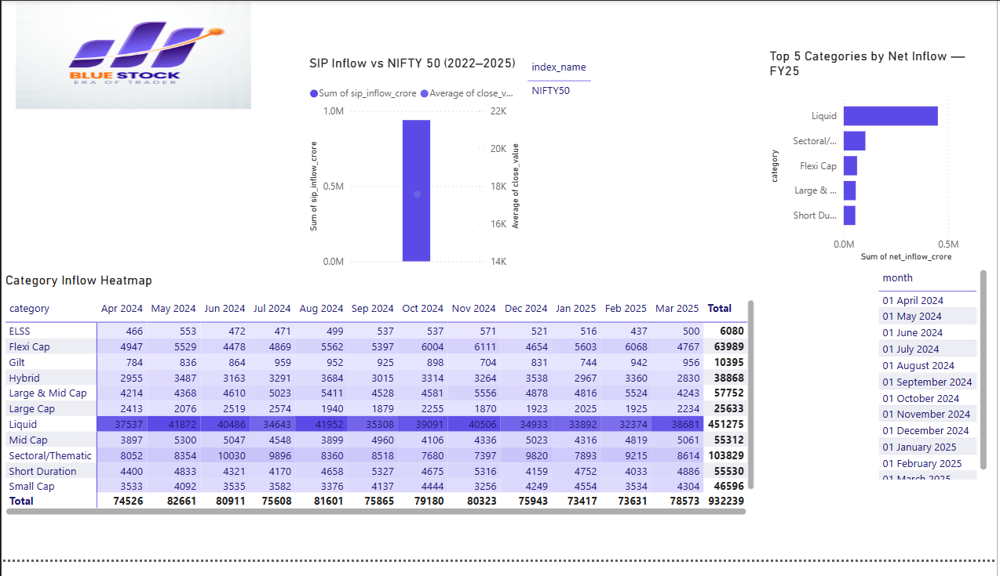

# 📊 Mutual Fund Analytics


## 📌 Project Overview

**Mutual Fund Analytics** is an end-to-end data analytics capstone project developed during the **Bluestock Fintech Data Analytics Internship**.

The project analyzes mutual fund market data, scheme performance, investor transactions, SIP activity, AUM, portfolio holdings, and benchmark data using **Python, Pandas, NumPy, SQL, SQLite, Jupyter Notebook, and Power BI**.

The complete workflow covers data ingestion, cleaning, validation, database creation, exploratory analysis, fund performance analysis, advanced risk analytics, investor/SIP analysis, recommendation logic, and dashboard reporting.

### 🔄 Analytics Workflow

```text
Raw Data
   ↓
Data Ingestion
   ↓
Data Cleaning & Validation
   ↓
SQLite Database
   ↓
EDA & Business Analysis
   ↓
Fund Performance Analytics
   ↓
Advanced Risk & Investor Analytics
   ↓
Mutual Fund Recommendation
   ↓
Power BI Dashboard
   ↓
Reports & Presentation
```

---

## 🎯 Project Objectives

- Ingest and organize multiple mutual fund datasets
- Clean and validate financial and investor data
- Store processed data in a structured SQLite database
- Perform exploratory data analysis
- Analyze fund performance and risk
- Compare funds using risk-adjusted metrics
- Analyze SIP activity and investor behavior
- Evaluate portfolio concentration
- Calculate VaR and CVaR risk metrics
- Analyze rolling Sharpe ratios
- Identify SIP continuity and at-risk investors
- Build a risk-based mutual fund recommendation system
- Create an interactive Power BI dashboard
- Generate actionable business insights

---

## 🗂️ Repository Structure

The repository is organized into separate folders for data, analysis, dashboards, reports, scripts, and SQL resources.

```text
Mutual-Fund-Analytics/
│
├── dashboard/
│   └── bluestock_mf_dashboard.pbix
│
├── data/
│   ├── db/
│   │   └── bluestock_mf.db
│   │
│   ├── processed/
│   │   ├── cleaned_01_fund_master.csv
│   │   ├── cleaned_03_aum_by_fund_house.csv
│   │   ├── cleaned_04_monthly_sip_inflows.csv
│   │   ├── cleaned_05_category_inflows.csv
│   │   ├── cleaned_06_industry_folio_count.csv
│   │   ├── cleaned_09_portfolio_holdings.csv
│   │   ├── cleaned_10_benchmark_indices.csv
│   │   ├── cleaned_investor_transactions.csv
│   │   ├── cleaned_nav_history.csv
│   │   └── cleaned_scheme_performance.csv
│   │
│   └── raw/
│       ├── 01_fund_master.csv
│       ├── 02_nav_history.csv
│       ├── 03_aum_by_fund_house.csv
│       ├── 04_monthly_sip_inflows.csv
│       ├── 05_category_inflows.csv
│       ├── 06_industry_folio_count.csv
│       ├── 07_scheme_performance.csv
│       ├── 08_investor_transactions.csv
│       ├── 09_portfolio_holdings.csv
│       ├── 10_benchmark_indices.csv
│       ├── SBI_Bluechip.csv
│       ├── ICICI_Bluechip.csv
│       ├── Nippon_Large_Cap.csv
│       ├── Axis_Bluechip.csv
│       ├── Kotak_Bluechip.csv
│       └── live_nav_125497.csv
│
├── notebooks/
│   ├── EDA_Analysis.ipynb
│   ├── performance_analytics.ipynb
│   └── Advanced_Analytics.ipynb
│
├── reports/
│   ├── Dashboard.pdf
│   ├── Mutual_Fund_Analytics_Final_Report.pdf
│   ├── Mutual_Fund_Analytics_Final_Presentation.pptx
│   ├── Page1_Industry_Overview.png
│   ├── Page2_Fund_Performance.png
│   ├── Page3_Investor_Analytics.png
│   ├── Page4_SIP_Market_Trends.png
│   ├── equity_fund_hhi.csv
│   ├── fund_scorecard.csv
│   ├── max_drawdown.csv
│   ├── rolling_sharpe_chart.png
│   ├── sip_continuity_analysis.csv
│   ├── tracking_error.csv
│   ├── var_cvar_report.csv
│   └── additional analytical charts and outputs
│
├── scripts/
│   ├── data_ingestion.py
│   ├── data_cleaning.py
│   ├── data_quality.py
│   ├── database_loader.py
│   ├── live_nav_fetch.py
│   ├── recommender.py
│   └── run_pipeline.py
│
├── sql/
│   ├── schema.sql
│   └── queries.sql
│
├── data_dictionary.md
├── requirements.txt
└── README.md
```

---

## 📚 Data Sources

The project uses **10 core datasets**:

| Dataset | Description |
|---|---|
| `01_fund_master.csv` | Mutual fund scheme master information |
| `02_nav_history.csv` | Historical NAV observations |
| `03_aum_by_fund_house.csv` | Assets Under Management by fund house |
| `04_monthly_sip_inflows.csv` | Monthly SIP inflows and SIP account metrics |
| `05_category_inflows.csv` | Category-wise mutual fund inflows |
| `06_industry_folio_count.csv` | Industry/category folio count information |
| `07_scheme_performance.csv` | Fund returns, risk, and performance metrics |
| `08_investor_transactions.csv` | Investor transaction and demographic information |
| `09_portfolio_holdings.csv` | Scheme portfolio holdings and sector allocation |
| `10_benchmark_indices.csv` | Benchmark index historical data |

### Additional API Data

Live NAV data was fetched using the **MF API** for selected schemes, including:

- SBI Bluechip
- ICICI Bluechip
- Nippon Large Cap
- Axis Bluechip
- Kotak Bluechip

The API-generated data is stored under:

```text
data/raw/
```

---

## 🛠️ Tech Stack

| Category | Technology |
|---|---|
| Programming | Python |
| Data Analysis | Pandas, NumPy |
| Visualization | Matplotlib, Seaborn, Plotly |
| Database | SQLite |
| Database Access | SQLAlchemy |
| API | Requests |
| Notebook | Jupyter Notebook |
| Dashboard | Microsoft Power BI |
| Version Control | Git / GitHub |

---

## ⚙️ ETL Pipeline

The master pipeline is located at:

```text
scripts/run_pipeline.py
```

It coordinates the following stages:

```text
data_ingestion.py
        ↓
data_cleaning.py
        ↓
data_quality.py
        ↓
database_loader.py
        ↓
live_nav_fetch.py
```

### Pipeline Responsibilities

**Data Ingestion**
- Loads raw CSV datasets
- Validates file availability and structure
- Inspects dataset shape, data types, and sample records

**Data Cleaning**
- Standardizes dates and categorical fields
- Handles duplicates and missing values
- Validates numerical values
- Generates cleaned datasets

**Data Quality**
- Validates relationships between datasets
- Checks AMFI code consistency
- Performs structural and data integrity checks

**Database Loading**
- Loads cleaned datasets into SQLite
- Creates analytical database tables

**Live NAV Fetching**
- Retrieves NAV information for selected schemes through the MF API

### Run the Pipeline

```bash
pip install -r requirements.txt
python scripts/run_pipeline.py
```

---

## 🧹 Data Cleaning & Validation

The cleaning workflow includes:

### NAV History
- Date conversion
- Sorting by AMFI code and date
- Duplicate removal
- Missing NAV handling
- Positive NAV validation

### Investor Transactions
- Transaction date standardization
- Transaction type standardization
- Transaction validation
- Transaction amount validation
- KYC status standardization
- Duplicate removal

### Scheme Performance
- Numeric type conversion
- Missing-value validation
- Expense-ratio validation
- Duplicate removal

### Other Datasets
- Duplicate removal
- Date/month conversion
- Data type standardization
- Missing-value validation
- Processed output generation

Cleaned datasets are stored in:

```text
data/processed/
```

---

## 🗄️ SQLite Database

The project uses SQLite to store and query the cleaned datasets.

Database:

```text
data/db/bluestock_mf.db
```

The database contains **10 analytical tables** and was loaded using **SQLAlchemy**.

Database resources:

```text
data/db/bluestock_mf.db
sql/schema.sql
sql/queries.sql
data_dictionary.md
```

---

## 🔎 Exploratory Data Analysis

The EDA phase analyzes:

- NAV trends
- AUM growth
- SIP inflow trends
- Category-wise inflows
- Investor demographics
- Geographic distribution
- Folio growth
- Sector allocation
- Daily NAV returns
- Fund performance
- Benchmark relationships

### Notebooks

```text
notebooks/EDA_Analysis.ipynb
notebooks/performance_analytics.ipynb
```

---

## 📈 Fund Performance Analytics

Funds are evaluated using both absolute-return and risk-adjusted metrics.

### Metrics

- Daily NAV returns
- 1-year returns
- 3-year returns
- 5-year returns
- CAGR
- Sharpe Ratio
- Sortino Ratio
- Alpha
- Beta
- Standard Deviation
- Maximum Drawdown
- Benchmark comparison
- Tracking Error
- Fund Scorecard

These metrics support comparison of funds based on both **return and risk-adjusted performance**.

---

## 📊 Advanced Analytics

Advanced analysis is implemented in:

```text
notebooks/Advanced_Analytics.ipynb
```

### 1. Value at Risk — VaR

VaR estimates potential portfolio loss at a selected confidence level.

Output:

```text
reports/var_cvar_report.csv
```

### 2. Conditional Value at Risk — CVaR

CVaR estimates the expected loss beyond the VaR threshold and provides an additional downside-risk measure.

### 3. Rolling Sharpe Ratio

Rolling Sharpe analysis evaluates changes in risk-adjusted performance over time.

Output:

```text
reports/rolling_sharpe_chart.png
```

### 4. SIP Continuity Analysis

SIP behavior was analyzed using:

- SIP transaction count
- Average gap between SIP transactions
- Investor continuity
- At-risk investor identification

Output:

```text
reports/sip_continuity_analysis.csv
```

### 5. Portfolio Concentration

The **Herfindahl-Hirschman Index (HHI)** was calculated to evaluate equity-fund portfolio concentration.

Output:

```text
reports/equity_fund_hhi.csv
```

---

## 👥 Investor & SIP Analytics

The investor transaction dataset contains:

```text
32,778 transactions
```

The SIP analysis identified:

```text
19,716 SIP transactions
4,762 unique SIP investors
1,362 investors with 6+ SIP transactions
```

The SIP continuity analysis classified eligible investors according to transaction frequency and average transaction gaps.

Final analysis results:

```text
SIP continuity rate: 2.20%
At-risk rate: 97.80%
```

These results highlight a potential opportunity for investor-retention and SIP-engagement strategies.

---

## 🤖 Mutual Fund Recommendation System

A risk-based recommendation system is implemented in:

```text
scripts/recommender.py
```

Run it with:

```bash
python scripts/recommender.py
```

The system accepts three risk categories:

```text
Low
Moderate
High
```

It recommends the **top three funds based on Sharpe Ratio** within the selected risk category.

Example:

```text
Risk appetite: Low

Top 3 Recommended Funds:

ICICI Pru Liquid Fund
Kotak Liquid Fund
ABSL Liquid Fund
```

The recommendation system was tested for all three risk categories.

> **Note:** The recommender is an analytical/educational model and is not intended to provide personalized financial advice.

---

## 📊 Power BI Dashboard

The interactive Power BI dashboard is available at:

```text
dashboard/bluestock_mf_dashboard.pbix
```

### Dashboard Pages

#### Page 1 — Industry Overview

Focuses on:

- Industry-level overview
- Fund and folio information
- Category distribution
- Market-level KPIs



#### Page 2 — Fund Performance

Focuses on:

- Fund returns
- Performance comparison
- Risk metrics
- Fund-level analysis



#### Page 3 — Investor Analytics

Focuses on:

- Investor demographics
- SIP behavior
- Investor segmentation
- Transaction analysis



#### Page 4 — SIP & Market Trends

Focuses on:

- SIP inflows
- SIP account trends
- Market/category trends
- Long-term market movement



A PDF export of the dashboard is also available:

```text
reports/Dashboard.pdf
```

---

## 💡 Key Business Insights

The analysis generated insights across fund performance, investor behavior, SIP activity, portfolio concentration, and market trends.

### Major Findings

- Risk-adjusted fund performance varies significantly across schemes.
- Low-risk funds can achieve strong Sharpe Ratios, particularly within liquid-fund categories.
- SIP investors demonstrate different levels of continuity and transaction gaps.
- A significant proportion of eligible long-term SIP investors were classified as at-risk under the defined continuity methodology.
- Portfolio concentration varies substantially across equity funds.
- SIP inflows and active SIP accounts highlight the importance of systematic investing behavior.
- Fund selection should consider risk-adjusted metrics rather than returns alone.

---

## 📦 Final Deliverables

| Deliverable | Location | Status |
|---|---|---|
| Final Report | `reports/Mutual_Fund_Analytics_Final_Report.pdf` | ✅ Completed |
| Final Presentation | `reports/Mutual_Fund_Analytics_Final_Presentation.pptx` | ✅ Completed |
| Power BI Dashboard | `dashboard/bluestock_mf_dashboard.pbix` | ✅ Completed |
| Dashboard PDF | `reports/Dashboard.pdf` | ✅ Completed |
| ETL Pipeline | `scripts/` | ✅ Completed |
| SQLite Database | `data/db/bluestock_mf.db` | ✅ Completed |
| EDA | `notebooks/EDA_Analysis.ipynb` | ✅ Completed |
| Performance Analytics | `notebooks/performance_analytics.ipynb` | ✅ Completed |
| Advanced Analytics | `notebooks/Advanced_Analytics.ipynb` | ✅ Completed |
| Recommendation System | `scripts/recommender.py` | ✅ Completed |
| SQL Resources | `sql/` | ✅ Completed |
| Data Dictionary | `data_dictionary.md` | ✅ Completed |

---

## ✅ Project Validation

The master pipeline was tested using:

```bash
python scripts/run_pipeline.py
```

The pipeline completed all major stages successfully:

```text
✓ Data Ingestion
✓ Data Cleaning
✓ Data Quality Validation
✓ SQLite Database Loading
✓ Live NAV Fetching

PIPELINE COMPLETED SUCCESSFULLY
```

The recommendation system was also tested for:

```text
✓ Low
✓ Moderate
✓ High
```

risk categories.

---

## ⚠️ Limitations

- The analysis is based on the datasets provided for the internship project.
- Historical performance does not guarantee future returns.
- The recommendation system primarily uses risk grade and Sharpe Ratio.
- Investor continuity classifications depend on the selected SIP-gap methodology.
- Portfolio concentration analysis depends on the available holdings data.
- Live NAV analysis depends on API availability.
- Power BI dashboard results depend on the underlying dataset and refresh status.
- The project is intended for analytical and educational purposes and should not be considered financial advice.

---

## 🚀 Future Improvements

Potential extensions include:

- Automating regular NAV and benchmark data updates
- Adding scheduled data refresh workflows
- Monitoring rolling risk metrics
- Integrating automated Power BI refresh
- Extending the recommendation model with additional fund characteristics
- Adding machine-learning-based fund classification
- Building a web-based analytics interface
- Adding automated data-quality monitoring
- Expanding investor segmentation and retention analytics

---

## 👨‍💻 Author

**Suraj Singh**

**Bluestock Fintech — Data Analytics Internship**

🔗 **GitHub Repository:**  
https://github.com/SPYDER-GIT/mutual-fund-analytics

---

## ⚠️ Disclaimer

This project was developed for **educational and internship purposes** as part of the **Bluestock Fintech Data Analytics Internship**.

The analysis, recommendations, and dashboard outputs demonstrate data analytics techniques and should **not be considered personalized investment or financial advice**.
